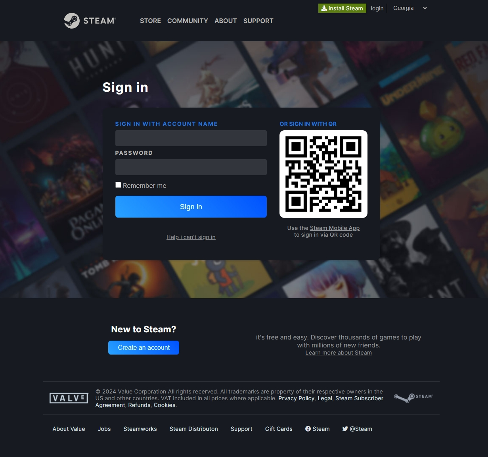
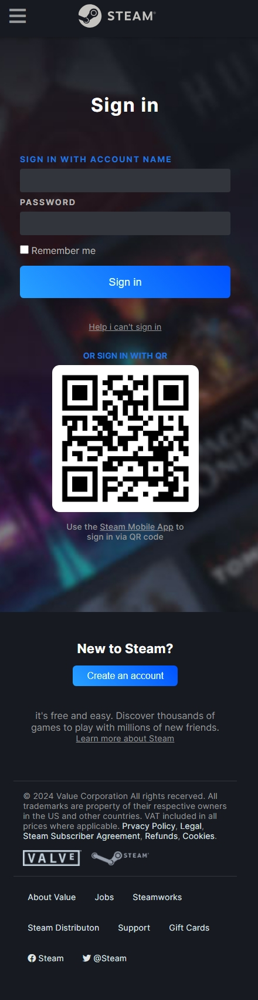

# Steam Authentication Clone

A clone of the Steam authentication system that allows users to sign in using their Steam account. This project is designed to replicate the look and feel of the original Steam login interface while providing a secure and functional authentication process.

## Features

- **Steam-like UI**: Replicates the Steam login interface for a familiar user experience.
- **Secure Authentication**: Utilizes OAuth to securely authenticate users via Steam.
- **Responsive Design**: Ensures the login page looks great on all devices, including desktops, tablets, and mobile phones.
- **Error Handling**: Provides user-friendly error messages for failed login attempts.

## Technologies Used

- **HTML**: For structuring the content on the web.
- **CSS**: For styling the application.
  - Flexbox: For layout structure.
  - Media Queries: For responsive design.
- **JavaScript**: For client-side logic and interactivity.

## Getting Started

### Installation

1. Clone the repository:
    ```bash
    git clone https://github.com/gabriel-pipia/steam-authentication-clone.git
    ```

2. Navigate to the project directory:
    ```bash
    cd steam-authentication-clone
    ```

## Usage

1. Open the application in your browser.
2. Click the "Sign in through Steam" button.
3. You will be redirected to the Steam login page.
4. After logging in, you will be redirected back to the application.

## Project Structure

- `index.html`: Main HTML file.
- `styles.css`: CSS file for styling the login page.
- `script.js`: Main application file.
- `README.md`: Project documentation.

## Screenshots




## License

This project is licensed under the MIT License. See the [LICENSE](LICENSE) file for details.

## Acknowledgements

- [Steam](https://steamcommunity.com/) for the authentication inspiration.
- [Font Awesome](https://fontawesome.com/) for icons.

## Author

Gabriel Pipia
- [GitHub](https://github.com/gabriel-pipia)

Feel free to contribute, open issues, or provide feedback!

---

Thank you for checking out this project!